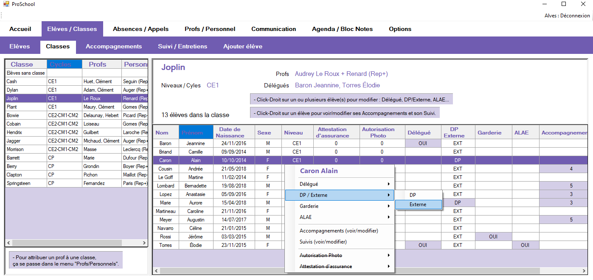
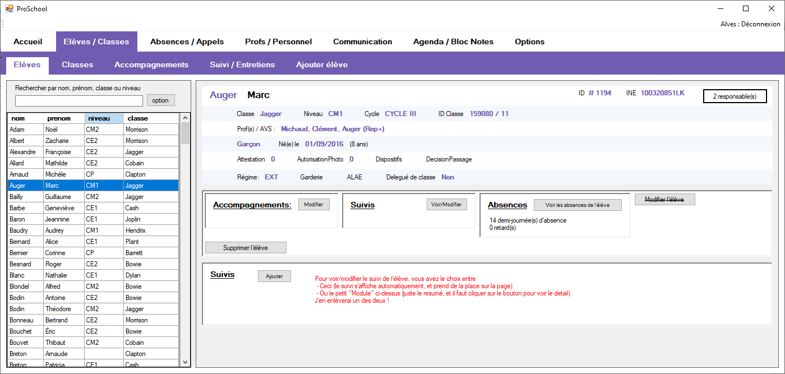
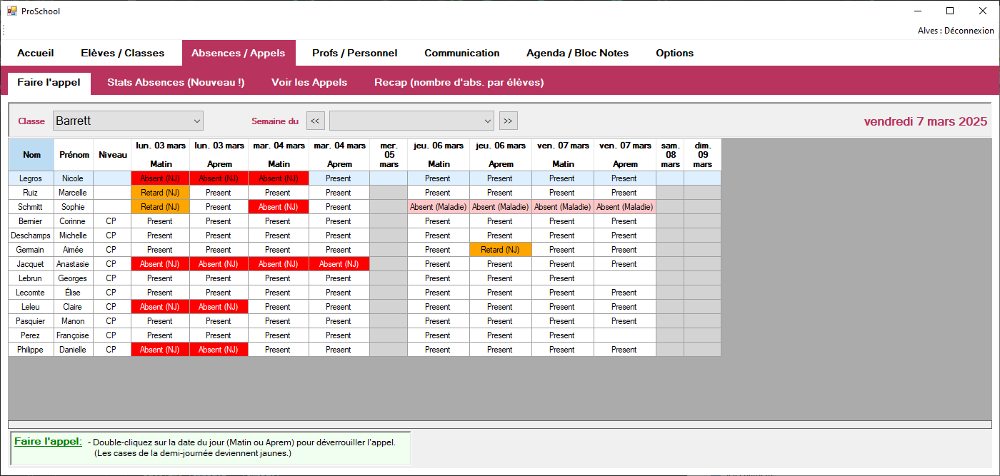
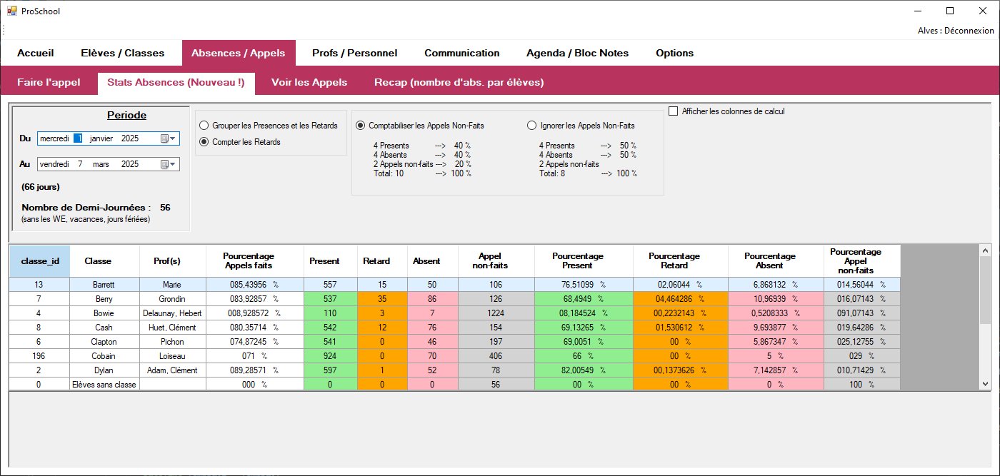
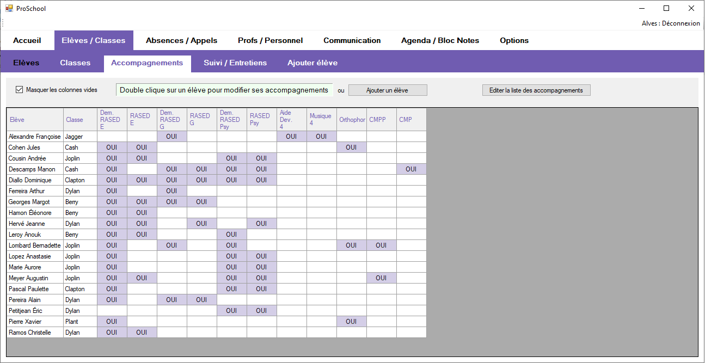

# ProSchool

&nbsp;&nbsp;

## Description

ProSchool est un logiciel de gestion scolaire développé en **C# .Net** pour une école élémentaire.

Il permet de gérer les informations relatives aux élèves et au personnel éducatif, ainsi que les absences et retards des élèves.
Le logiciel offre également des fonctionnalités de suivi des élèves, de gestion des accompagnements spécifiques, et de communication via une messagerie interne.

## Fonctionnalités

- **Gestion des élèves et du personnel éducatif**

  - Ajouter, modifier et supprimer des informations sur les élèves et le personnel.

- **Gestion des absences et retards**

  - Enregistrement et suivi des absences et retards des élèves.
  - Affichage de statistiques sur les absences.

- **Suivi et accompagnement spécifique des élèves**

- **Agenda**

  - Un calendrier pour organiser les événements scolaires et suivre les emplois du temps.

- **Messagerie**
  - Envoi et réception de messages entre le personnel éducatif et les élèves.
